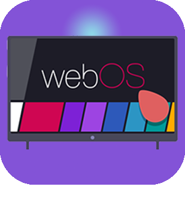
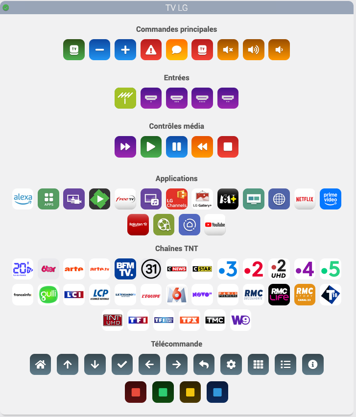
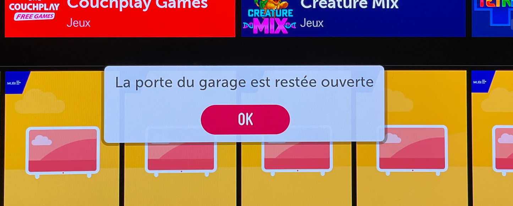
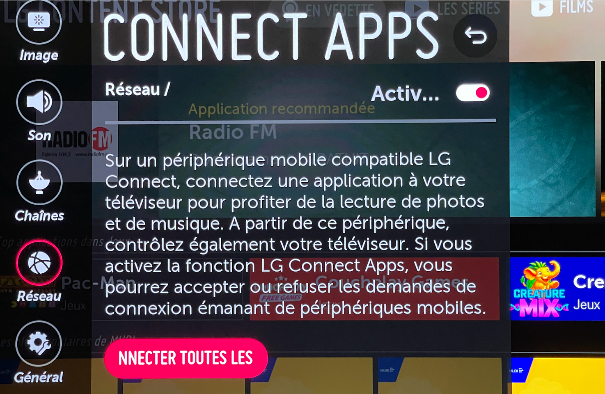

 
&nbsp;&nbsp;&nbsp;&nbsp;&nbsp;&nbsp;&nbsp;&nbsp;&nbsp;&nbsp;

# Plugin webOS pour Jeedom

## [Changelog :](docs/CHANGELOG.md) - Historique des versions

## 📋 Description

Le plugin webOS permet de piloter les téléviseurs LG équipés du système WebOS directement depuis Jeedom.  
Il utilise le code python de **klattimer** https://github.com/klattimer/LGWebOSRemote

Il offre un contrôle complet de votre TV LG incluant la gestion des applications, des entrées, des chaînes TNT, des commandes média et bien plus.

**Multi-TV** : Le plugin webOS permet de contrôler **plusieurs téléviseurs LG** dans votre installation domotique

## ⚡ Fonctionnalités

- **Fonction Multi-TV** : Piloter et contrôler plusieurs téléviseurs plusieurs TV
- **Commandes de base** : Allumer/Éteindre, Volume, Changement de chaînes
- **Gestion des entrées** : Basculer entre Live TV, HDMI, AV, etc.
- **Applications** : Lancement des applications LG et Apps personnelles installées (Netflix, Prime vidéo, YouTube, etc.)
- **Chaînes TNT** : Accès direct aux chaînes de télévision
- **Contrôles média** : Lecture, Pause, Stop, Avance/Retour rapide
- **Notifications** : Envoi de notification sur l'écran de la TV
- **Statut** : Surveillance de l'état de la TV
- **Message d'alerte** : Envoi de message d'alerte sur l'écran de la TV (Version 4.0 minimum)

&nbsp;&nbsp;&nbsp;&nbsp;&nbsp;&nbsp;&nbsp;&nbsp;&nbsp;&nbsp;

## 🚀 Installation

1. Rendez-vous dans le Market Jeedom
2. Recherchez "webOS" 
3. Cliquez sur "Installer"
4. Activez le plugin
5. Attendez l'installation des dépendances (lancement automatique)

## ⚙️ Configuration

### 1️⃣ Activation de LG Connect Apps  
  

  **Important** : Avant toute configuration dans Jeedom, vous devez activer **LG Connect Apps** sur votre TV LG :

  1. Sur votre TV LG, accédez au menu de configuration
  2. Allez dans **Réseau** → **LG Connect Apps**
  3. **Activez** l'option

### 2️⃣ Configuration dans Jeedom

  1. Allez dans **Plugins** → **Multimédia** → **webOS**
  2. Cliquez sur **Ajouter** pour créer un nouvel équipement
  3. Donnez un nom à votre TV
  4. Configurez les paramètres :
     - Saissisez l'adresse IP de votre TV LG
     > **Note** : Si vous laissez l'adresse IP vide, le plugin tentera une découverte automatique
     - Association LG Connect Apps : Laissez ce champ vide lors de la première configuration.
  5. Choisissez les groupes de commandes à créer :
     - **Commandes principales** : Allumer, Éteindre, Volume, Chaînes, Notification, Message d'alerte.
     - **Entrées** : Live TV, HDMI, AV.
     - **Contrôles média** : Lecture, Pause, Stop, etc.
     - **Applications** : Les apps LG et celles que vous avez installées (Netflix, Prime Vidéo, YouTube, etc.
     - **Chaînes TNT** : Chaînes TNT de télévision.

     - **TOUJOURS PRET** : Cochez cette case si la fonction **"Toujours Prêt"** est disponible et activée sur votre TV.
      (fonction disponible selon la version de votre TV).

### 3️⃣ Association avec la TV ! La TV doit etre impérativement allumée !

  1. **Sauvegardez** votre equipement
  2. Une fenêtre apparaîtra sur votre TV demandant l'autorisation de la connexion
  3. **Acceptez** la connexion sur votre TV
  4. L'association se fait automatiquement
  5. Les informations de la TV sont récupérées automatiquement : Modèle, Version WebOS, Adresse MAC

---

## 🖥️ Interface utilisateur

### 📋 Widget

  Le widget sur le dashboard affiche :
  - **Indicateur d'état** : Vert (allumée) / Rouge (éteinte)
  - **Sectionss** : Commandes principales / Entrées / Contrôles média / Applications / Chaînes TNT

### ⚙️ Configuration de l'équipement 

  L'interface de configuration est organisée en onglets :

  1. **Équipement** : Configuration générale
  2. **Commandes principales** : Gestion des commandes essentielles
  3. **Entrées** : Gestion des entrées
  4. **Contrôles média** : Commandes de lecture
  5. **Applications** : Liste des apps
  6. **Chaînes TNT** : Liste des chaînes TNT

---
## 🔧 Résolution des problèmes

### 🔍 La TV n'est pas détectée
  - Vérifiez que **LG Connect Apps** est activé
  - Vérifiez que la TV et Jeedom sont sur le même réseau local
  - Essayez de redémarrer votre TV
  - Vérifiez l'adresse IP de la TV

### 🔗 La connexion avec la TV échoue
  - Supprimez "authenticated" et ressayez
  - Vérifiez que vous acceptez bien la connexion sur la TV

## 📱 Applications manquantes
  - Téléviseur allumée, sauvegardez à nouveau l'équipement pour forcer la récupération

---

## ❓ Questions fréquentes (FAQ)

### 📺 Puis-je contrôler plusieurs TV ?
Oui, créez un équipement par TV. Chaque TV aura ses propres commandes et configuration.

### ♻️ Quand je sauvegarde mon équipement, jeedom tourne en rond ?
Toutes les modifications doivent etre faites télévision allumée.

### 🐌 Les commandes sont lentes ?
Cela peut être normal selon la version WebOS. Les TV plus récentes sont généralement plus réactives.

### 🔄 Comment réinitialiser l'association ?
Supprimez **authenticated** dans la configuration et sauvegardez. Le processus d'appairage redémarrera.

### 📱 Certaines applications n'apparaissent pas ?
Le plugin filtre automatiquement les applications système. Seules les applications utilisateur sont affichées.

## 🆘 Support et communauté
- **Forum** : [Community Jeedom](https://community.jeedom.com/tag/plugin-webOS)

---

*Cette documentation est maintenue à jour avec la dernière version du plugin. N'hésitez pas à consulter le changelog pour les nouveautés.*

